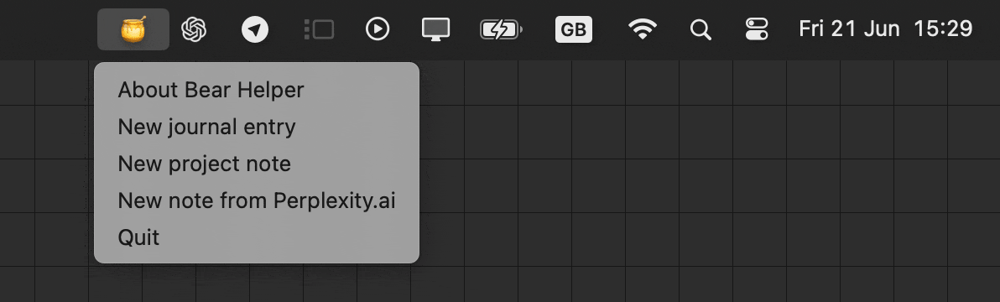
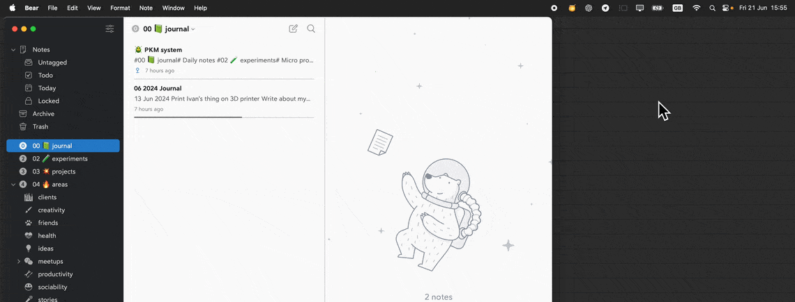
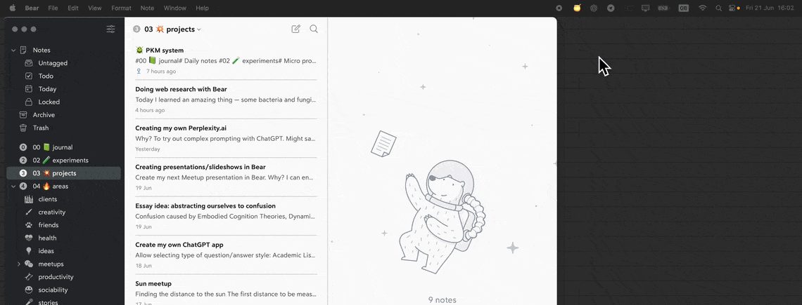
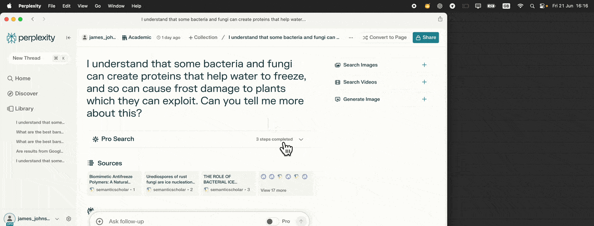

# Bear Helper, an easy-to-customize macOS menubar helper for the Bear app, written in Python

[Read my blog post about this script.](https://www.beyond2060.com/technical/24-06/bear-helper/)

Apple Shortcuts app is annoying. It's full of idiosyncrasies and minor frustrations. I got annoyed trying to use it to do simple things with the wonderful [Bear App](https://bear.app). So I created _Bear Helper_, an easy-to-customize menubar app, written in Python. This is what it looks like:  

I find it much more satisfying to customize _Bear Helper_ than to use Apple's Shortcuts app. It's quicker to write and debug Python code than to work out the idiosyncratic way  Shortcuts operates. _Bear Helper_ should be  easy to customize and extend, if you're a techie. These are the types of things it can do for you:

# Uses of _Bear Helper_

### Daily journal template

An example daily journal template creates a new note titled with today's date and a few example headings. It also tags it with nested tags based on the date, which is a really nice way of structuring journal entries.  It should be really easy to modify, and add other templates, by just editing the Python code. You could do fancy things like automatically inserting the weather and top news headlines, for example. Here's what it looks like:

### Project template

I spend a lot of time experimenting and learning new things. I try to make everything I do into mini projects, following the [PARA method](https://fortelabs.com/blog/para/). To make sure I make proper use of my time, and have a record of what I've done to refer back to, I have created a _Project note_. I do a similar thing with my clients and have found it [an effective way to make keep a useful record of my work](/technical/regular-note-taking/). 

### Pre-process incompatible markdown before pasting into Bear

This was the main reason I created _Bear Helper_. If you copy a response from [Perplexity.ai](https://www.perplexity.ai), the Markdown it uses for references is not compatible with Bear. The Bear Helper takes the contents of the clipboard and does a bit of search and replace on it, to make it compatible with Bear. Here it is in action:

